### Hi, I'm Vish 👋

**Digital marketer who builds his own AI tools.** Growth, performance, partnerships and client management, with AI underneath.

Five years across creator partnerships, paid and organic social, client leadership and campaign reporting, for brands like HUL (Unilever), Philips, L'Oréal and Tata. 850+ creator deals, a 12-person team, 20+ brand accounts. Now based in Germany (MBA, Hochschule Offenburg), I build the tools I wish I'd had: each one turns a slow, error-prone part of marketing into minutes.

> **Start here:** [Growth Experiment Lab](https://github.com/Vishwajeetkumbhar379/growth-experiment-lab) (A/B tests read properly) · [Job Search Agent](https://github.com/Vishwajeetkumbhar379/job-search-agent) (the agent running my own job search) · [Client Health Score](https://github.com/Vishwajeetkumbhar379/client-health-score) (churn risk before it happens)

#### Growth & analytics

| Repo | What it does |
|---|---|
| [**growth-experiment-lab**](https://github.com/Vishwajeetkumbhar379/growth-experiment-lab) · [live app](https://vishwajeetkumbhar379.github.io/growth-experiment-lab/) | Reads A/B tests honestly (z-test, confidence interval, chance B beats A), plans test duration, ranks ideas with ICE |
| [**marketing-attribution-lab**](https://github.com/Vishwajeetkumbhar379/marketing-attribution-lab) | Six attribution models side by side, including a data-driven Markov chain model |

#### Performance marketing

| Repo | What it does |
|---|---|
| [**ad-performance-copilot**](https://github.com/Vishwajeetkumbhar379/ad-performance-copilot) | Weekly Meta, Google and LinkedIn Ads review: creative fatigue, wasted spend, CPA spikes and a budget-shift plan |

#### Clients & partnerships

| Repo | What it does |
|---|---|
| [**client-health-score**](https://github.com/Vishwajeetkumbhar379/client-health-score) | Scores client accounts, flags churn risk and upsell signals, drafts QBRs with Claude |
| [**campaign-report-autopilot**](https://github.com/Vishwajeetkumbhar379/campaign-report-autopilot) | The client report built every Monday by GitHub Actions, with scale / keep / test / cut calls |
| [**creator-fit-scorer**](https://github.com/Vishwajeetkumbhar379/creator-fit-scorer) | Ranks creators against a brand brief with explainable scores and risk flags |
| [**creator-contract-checker**](https://github.com/Vishwajeetkumbhar379/creator-contract-checker) | Flags risky clauses in influencer contracts, with a labelled eval set |

#### AI agents & content

| Repo | What it does |
|---|---|
| [**job-search-agent**](https://github.com/Vishwajeetkumbhar379/job-search-agent) | The agent behind my own job search: live ATS discovery, evidence-based scoring, an AI-writing linter |
| [**creator-brief-mcp**](https://github.com/Vishwajeetkumbhar379/creator-brief-mcp) | An MCP server giving Claude marketing tools, including EU ad-disclosure checks |
| [**claude-skills**](https://github.com/Vishwajeetkumbhar379/claude-skills) | Seven Agent Skills behind my workflows |
| [**linkedin-carousel-studio**](https://github.com/Vishwajeetkumbhar379/linkedin-carousel-studio) | Outline in, on-brand LinkedIn carousel out |

#### How I build with AI

- **Rules decide, AI refines.** Where money or compliance is involved, code makes the call; the model explains, drafts and adds judgement.
- **Structured output.** Models return JSON against a schema through tool use, and the code checks it.
- **Agents that run on their own,** with a human approving anything that leaves.
- **Measured.** Tests on every repo, evals where accuracy matters.

#### Find me

[Portfolio](https://vishkumbhar.netlify.app) · [CV (PDF)](https://vishkumbhar.netlify.app/Vishwajeet_Kumbhar_CV.pdf) · [LinkedIn](https://www.linkedin.com/in/vishwajeetkumbhar379) · vishwajeetkumbhar379@gmail.com

Open to growth, performance, digital marketing, partnerships and account management roles · remote first, Berlin welcome · Python, Claude API, MCP, GitHub Actions
